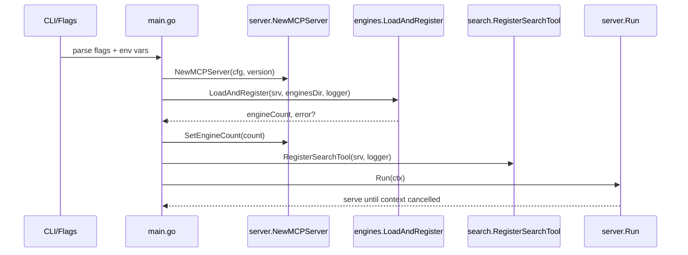
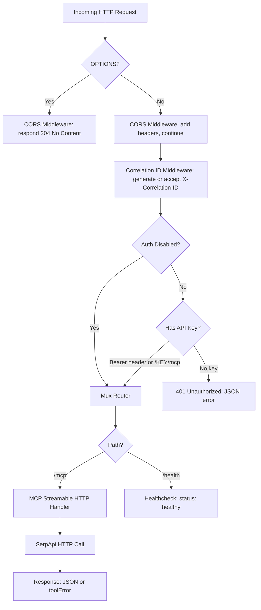
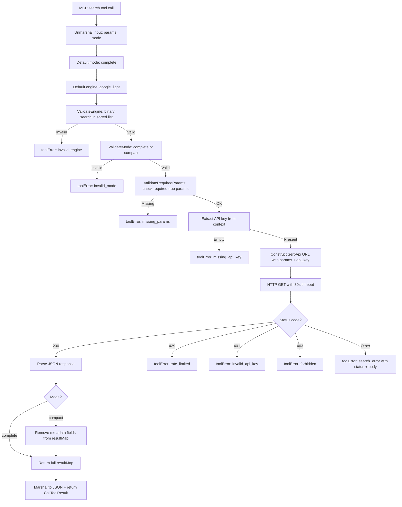

# Architecture

SerpApi MCP Server is a Go-based Model Context Protocol (MCP) server that exposes SerpApi search capabilities through a single, authenticated HTTP endpoint. This document covers the package layout, request flows, subsystem designs, test structure, and CI/CD pipeline.

- **Module:** `github.com/agenthands/serpapi-mcp`
- **Go version:** 1.25
- **Sole external dependency:** `github.com/modelcontextprotocol/go-sdk v1.5.0`

## Package Layout

### `cmd/serpapi-mcp` — Entry Point

CLI entry point: flag parsing, env var resolution, and server initialization orchestration.

No exported types (main package).

Key functions:

- `run(ctx context.Context, args []string, stdout io.Writer, stderr io.Writer) error` — all startup logic, extracted from `main()` for testability
- `envOr(key, fallback string) string` — env var with string fallback
- `envIntOr(key string, fallback int) int` — env var with int fallback
- `envBoolOr(key string, fallback bool) bool` — env var with bool fallback (1/true/yes)

Build-time variables: `version`, `commit`, `date` — injected via goreleaser ldflags.

Dependencies: `internal/server`, `internal/engines`, `internal/search`

### `internal/server` — MCP Server, Auth & CORS

HTTP server lifecycle, MCP protocol routing, authentication, and CORS handling.

Key types:

- `Config` — server configuration (Host, Port, CorsOrigins, AuthDisabled)
- `MCPServer` — wraps `mcp.Server` with HTTP handler, healthcheck, graceful shutdown
- `CORSConfig` — allowed origins list

Key functions:

- `NewMCPServer(cfg Config, version string) *MCPServer` — creates MCP server with streamable HTTP transport
- `buildHandler() http.Handler` — constructs chain: CORS → correlation → auth → mux
- `Run(ctx context.Context) error` — starts serving with graceful shutdown (10s timeout)
- `APIKeyFromContext(ctx context.Context) string` — extracts API key from request context
- `ContextWithAPIKey(ctx context.Context, key string) context.Context` — stores API key in context
- `NewCORSConfig(origins string) *CORSConfig` — parses comma-separated origins string
- `authOrPassthrough(disabled bool, next http.Handler) http.Handler` — auth or passthrough based on config
- `authMiddleware(next http.Handler) http.Handler` — Bearer header (priority) → path /{KEY}/mcp → 401

Dependencies: `internal/middleware`, `github.com/modelcontextprotocol/go-sdk/mcp`

### `internal/engines` — Engine Schema Loading & Discovery

Load, validate, and serve SerpApi engine JSON schemas as MCP resources.

Key types:

- `engineSchema` (unexported) — holds engine name + raw JSON

Key functions:

- `LoadAndRegister(srv *mcp.Server, enginesDir string, logger *slog.Logger) (int, error)` — loads all `.json` files, validates, registers MCP resources
- `EngineNames() []string` — returns sorted list of loaded engine names
- `RequiredParams(engineName string) []string` — extracts params with `required:true` from schema

Validation: filename must match `[a-z0-9_]+.json`, engine field must match filename stem. Fail-fast: returns error on first invalid/mismatched file.

Dependencies: `github.com/modelcontextprotocol/go-sdk/mcp`

### `internal/search` — Search Tool & Validation

MCP search tool implementation with input validation and SerpApi HTTP calls.

Key functions:

- `RegisterSearchTool(srv *mcp.Server, logger *slog.Logger)` — registers "search" tool on MCP server
- `callSearchTool(ctx context.Context, req *mcp.CallToolRequest) (*mcp.CallToolResult, error)` — core handler: unmarshal → validate → HTTP call → response
- `ValidateEngine(engine string) error` — binary search against loaded engine list
- `ValidateMode(mode string) error` — "complete" or "compact"
- `ValidateRequiredParams(engine string, params map[string]any) error` — checks `required:true` params present
- `toolError(code, message string) *mcp.CallToolResult` — flat JSON `{"error": code, "message": msg}` with `IsError=true`

Compact mode removes: `search_metadata`, `search_parameters`, `search_information`, `pagination`, `serpapi_pagination`. Default engine: `google_light`. Default mode: `complete`. 30-second per-request timeout via context.

Dependencies: `internal/engines`, `internal/middleware`, `internal/server`

### `internal/middleware` — HTTP Middleware

Cross-cutting HTTP middleware for request correlation.

Key functions:

- `CorrelationIDMiddleware(next http.Handler) http.Handler` — injects 32-char hex correlation ID
- `CorrelationIDFromContext(ctx context.Context) string` — extracts correlation ID
- `generateCorrelationID() string` — crypto/rand → 16 bytes → 32-char hex

Constants:

- `CorrelationIDHeader = "X-Correlation-ID"` — header name for client-provided or generated ID

Dependencies: none (only stdlib)

### Wiring at Startup

The `cmd/serpapi-mcp/main.go` `run()` function wires all packages together:

```go
mcpServer := server.NewMCPServer(cfg, version)
engineCount, err := engines.LoadAndRegister(mcpServer.MCPServer, *enginesDirFlag, slog.Default())
mcpServer.SetEngineCount(engineCount)
search.RegisterSearchTool(mcpServer.MCPServer, slog.Default())
return mcpServer.Run(ctx)
```

Flag/env parsing produces a `server.Config`, which creates the MCP server. Engine schemas are loaded and registered as MCP resources, then the search tool is registered. Finally, `Run()` starts the HTTP listener and blocks until the context is cancelled (SIGINT/SIGTERM).

## Startup Sequence



```
┌─────────────┐
│  CLI/Flags  │  Parse --host, --port, --cors-origins,
│  + env vars │  --auth-disabled, --engines-dir
└──────┬──────┘
       │
       ▼
┌──────────────────────┐
│  server.NewMCPServer │  Create MCP server with streamable HTTP
│  (cfg, version)      │  transport, build handler chain
└──────┬───────────────┘
       │
       ▼
┌────────────────────────────┐
│  engines.LoadAndRegister   │  Read engines/*.json, validate
│  (srv, enginesDir, logger)│  filenames, check engine field,
└──────┬─────────────────────┘  register MCP resources
       │ engineCount  ◄── fail-fast: returns error on
       ▼                  first invalid schema
┌──────────────────────┐
│  server.SetEngineCount│  Store count for startup logging
└──────┬───────────────┘
       │
       ▼
┌────────────────────────────┐
│  search.RegisterSearchTool │  Register "search" tool on
│  (srv, logger)             │  MCP server
└──────┬─────────────────────┘
       │
       ▼
┌──────────────────────┐
│  server.Run(ctx)     │  Start HTTP listener, block
│                      │  until SIGINT/SIGTERM via ctx
└──────────────────────┘
```

ASCII diagram (works in terminals and editors):

Flag/env parsing happens first (host, port, cors-origins, auth-disabled, engines-dir). Server creation initializes the MCP server and builds the handler chain. Engine loading is fail-fast — if any schema is invalid, the process exits with error. After search tool registration, the HTTP listener starts and blocks until SIGINT/SIGTERM via the signal context.

## HTTP Request Flow



```
Incoming HTTP Request
         │
         ▼
   ┌─────────────┐    OPTIONS?
   │  CORS        │──────────►  204 No Content (preflight)
   │  Middleware   │
   └──────┬──────-┘
          │  Add CORS headers, continue
          ▼
   ┌────────────────┐
   │  Correlation ID │  Client X-Correlation-ID or
   │  Middleware      │  generate 32-char hex from crypto/rand
   └──────┬─────────┘
          │
          ▼
   ┌─────────────┐    Auth disabled (--auth-disabled)?
   │  Auth        │──────────►  Skip to mux
   │  Middleware   │
   └──────┬──────-┘
          │  Check API key
          ├─── Bearer header (priority)
          ├─── /{KEY}/mcp path (fallback)
          │
          ▼
   ┌──────────┐     No key? ──►  401 {"error": "Missing API key..."}
   │  Mux      │
   │  Router    │
   └──────┬───-┘
          │
          ├──/health──►  {"status":"healthy","service":"SerpApi MCP Server"}
          │
          └──/mcp─────►  MCP Streamable HTTP Handler
                              │
                              ▼
                        SerpApi HTTP Call (30s timeout)
                              │
                              ▼
                        Response: JSON or toolError
```

ASCII diagram (works in terminals and editors):

Handler chain ordering: CORS first (so OPTIONS preflight gets CORS headers without hitting auth), then correlation ID, then auth, then mux router. Auth priority: Bearer header first, then path-based `/{KEY}/mcp`. The `/health` endpoint is exempt from authentication. Auth-disabled mode (`--auth-disabled` flag or `MCP_AUTH_DISABLED` env var) skips auth middleware entirely via `authOrPassthrough`.

## Engine Loading Pipeline

```mermaid
flowchart TD
    A[engines/ directory] --> B[os.ReadDir: list .json files]
    B --> C{Filename matches ^[a-z0-9_]+.json?}
    C -->|No| D[Skip with warning log]
    C -->|Yes| E[Read and parse JSON]
    E --> F{engine field == filename stem?}
    F -->|No| G[Return error: fail-fast]
    F -->|Yes| H[Add to schemas map + names list]
    H --> I[Sort engine names alphabetically]
    I --> J[Cache: engineNamesStore + schemasStore]
    J --> K[Register serpapi://engines index resource]
    J --> L[Register serpapi://engines/{name} per-engine resources]
    K --> M[Return engineCount]
    L --> M
```

ASCII diagram (works in terminals and editors):

```
engines/ directory
       │
       ▼
┌─────────────────────┐
│  os.ReadDir         │  List all .json files
└──────┬──────────────┘
       │
       ▼
┌──────────────────────┐
│  Filename matches    │─── No ──►  Skip with warning log
│  ^[a-z0-9_]+.json?  │
└──────┬───────────────┘
       │ Yes
       ▼
┌─────────────────┐
│  Read & parse   │
│  JSON           │
└──────┬──────────┘
       │
       ▼
┌──────────────────────┐
│  engine field ==     │─── No ──►  Return error (fail-fast)
│  filename stem?      │
└──────┬───────────────┘
       │ Yes
       ▼
┌─────────────────────────┐
│  Add to schemas map +   │
│  names list              │
└──────┬──────────────────┘
       │
       ▼
┌─────────────────────────┐
│  Sort engine names      │
│  alphabetically          │
└──────┬──────────────────┘
       │
       ▼
┌─────────────────────────┐
│  Cache: engineNamesStore│
│  + schemasStore          │
└──────┬──────────────────┘
       │
       ├──── Register serpapi://engines index
       ├──── Register serpapi://engines/{name} per-engine
       │
       ▼
  Return engineCount
```

All ~107 engine schemas are loaded at startup. Loading is fail-fast — any invalid schema causes the process to exit with an error. Filename validation enforces the `[a-z0-9_]+` pattern; non-matching files are skipped with a warning log. Strict validation requires the engine JSON field to match the filename stem (e.g., `google.json` must have `"engine": "google"`). Resource handler closures capture pre-serialized JSON to avoid re-serialization per request. Accessor functions (`EngineNames`, `RequiredParams`) read from cached package-level stores.

## Search Execution



ASCII diagram (works in terminals and editors):

```
MCP search tool call
       │
       ▼
Unmarshal input {params, mode}
       │
       ├── Default mode: "complete"
       ├── Default engine: "google_light"
       │
       ▼
ValidateEngine ──── Invalid ──►  toolError("invalid_engine")
       │
       ▼ Valid
ValidateMode ──── Invalid ──►  toolError("invalid_mode")
       │
       ▼ Valid
ValidateRequiredParams ── Missing ──►  toolError("missing_params")
       │
       ▼ OK
Extract API key from context ── Empty ──►  toolError("missing_api_key")
       │
       ▼ Present
Construct SerpApi URL (params + api_key)
       │
       ▼
HTTP GET (30s timeout via context)
       │
       ▼
Status code?
  ├── 200 ──►  Parse JSON
  ├── 429 ──►  toolError("rate_limited")
  ├── 401 ──►  toolError("invalid_api_key")
  ├── 403 ──►  toolError("forbidden")
  └── Other ─►  toolError("search_error", status + body)
       │
       ▼  (from 200 path)
Mode?
  ├── "compact" ──►  Remove metadata fields
  └── "complete" ──►  Return full resultMap
       │
       ▼
Marshal to JSON + return CallToolResult
```

Input validation runs BEFORE any HTTP call (fail-fast). Three validation stages: engine name, mode, and required params. The API key is extracted from context (set by auth middleware). A shared `http.Client` with persistent connection pool handles requests with a per-request 30s timeout via context. All errors are returned as MCP-compliant `IsError=true` with flat JSON body `{"error": code, "message": msg}`. Compact mode removes top-level metadata keys (`search_metadata`, `search_parameters`, `search_information`, `pagination`, `serpapi_pagination`) for smaller responses.

## Authentication Design

Two authentication methods are supported:

1. **Bearer header** (`Authorization: Bearer {KEY}`) — takes priority
2. **Path-based** (`/{KEY}/mcp`) — fallback method

The auth middleware strips the key segment from the URL path before forwarding to the mux router, so downstream handlers see `/mcp` rather than `/{KEY}/mcp`. The API key is stored in the request context via a custom `contextKey` type and retrieved downstream with `APIKeyFromContext()`.

The `/health` endpoint is exempt from authentication.

Auth-disabled mode is enabled via the `--auth-disabled` flag or `MCP_AUTH_DISABLED` env var. When active, `authOrPassthrough()` wraps the next handler as a passthrough instead of applying auth middleware — useful for local development and testing.

On missing authentication, the middleware returns a 401 response with JSON body:

```json
{"error": "Missing API key. Use path format /{API_KEY}/mcp or Authorization: Bearer {API_KEY} header"}
```

## Observability

**Correlation IDs:** Each request receives a 32-character hex correlation ID generated from `crypto/rand` (16 bytes → 32 hex chars). Clients may provide their own via the `X-Correlation-ID` request header; if absent, the server generates one. The correlation ID is echoed back in the `X-Correlation-ID` response header.

**Context propagation:** `CorrelationIDFromContext()` is used by the search tool to include correlation IDs in structured log entries, enabling request tracing across the handler chain.

**Structured logging:** `slog` is used throughout with contextual fields:
- Engine loading logs: count at startup
- Search tool logs: `correlation_id`, `engine`, `mode`, `params_count`
- Server logs: `address`, `version`, `engines_loaded`

## Error Handling

**Auth errors:** 401 JSON `{"error": "Missing API key..."}` with guidance on both auth methods.

**Search tool errors:** MCP `IsError=true` with flat JSON `{"error": "<code>", "message": "<desc>"}`. Error codes:

| Code | Trigger |
|------|---------|
| `invalid_engine` | Engine name not found in loaded engine list |
| `invalid_mode` | Mode is not "complete" or "compact" |
| `missing_params` | Required parameter(s) missing from request |
| `missing_api_key` | No API key in request context |
| `search_error` | Generic search failure (includes status + body) |
| `rate_limited` | SerpApi returned HTTP 429 |
| `invalid_api_key` | SerpApi returned HTTP 401 |
| `forbidden` | SerpApi returned HTTP 403 |

SerpApi HTTP status mapping: 200 → success, 429 → `rate_limited`, 401 → `invalid_api_key`, 403 → `forbidden`, other → `search_error` with status and body. All tool errors are non-fatal — returned as results (not Go errors), so the MCP protocol handles them correctly.

## Testing

### Test Suite Structure

| Test File | Package | Type | Focus |
|-----------|---------|------|-------|
| `main_test.go` | `cmd/serpapi-mcp` | Unit | Flag parsing, env var helpers, `run()` function |
| `engines_test.go` | `internal/engines` | Unit | Schema loading, validation, accessor functions |
| `correlation_test.go` | `internal/middleware` | Unit | ID generation, context propagation, header handling |
| `search_test.go` | `internal/search` | Unit + Integration | Search tool handler, SerpApi mock, compact mode, error codes |
| `validation_test.go` | `internal/search` | Unit | ValidateEngine, ValidateMode, ValidateRequiredParams |
| `auth_test.go` | `internal/server` | Unit + Integration | Bearer/path auth, edge cases, context key, auth-disabled mode |
| `cors_test.go` | `internal/server` | Unit | CORS headers, preflight, origin config |
| `server_test.go` | `internal/server` | Integration | Full handler chain, healthcheck, startup, graceful shutdown |

~2,500 lines across 8 test files.

**Unit tests** isolate individual functions (validation, env helpers, ID generation, CORS config). **Integration tests** exercise the full handler chain (CORS → correlation → auth → mux). The `run()` function in `cmd/serpapi-mcp/main.go` is extracted from `main()` specifically for testability — `main()` is a 2-line wrapper. Search tests override `serpapiBaseURLResolver` to point to `httptest.NewServer` for controlled responses. Engine tests use `os.ReadDir` + `.json` extension filtering instead of hardcoding engine count.

### Running Tests

```bash
make test          # go test -count=1 ./...
make test-race     # go test -race -count=1 ./...
make cover         # go test -coverprofile=coverage.out -covermode=atomic ./...
make lint          # golangci-lint run ./...
make vet           # go vet ./...
```

Coverage target: >70% per `make cover`. CI enforces `-race` flag for all test runs to catch data races.

## CI/CD Pipeline

### CI Workflow

`.github/workflows/ci.yml` — triggers on push to `main` and pull requests to `main`.

Job: `lint-and-test` on `ubuntu-latest`

Steps:

1. `actions/checkout@v4`
2. `actions/setup-go@v5` — Go 1.25.x with module cache
3. golangci-lint action (latest version)
4. `go vet ./...`
5. `go test -race -count=1 ./...`

### Release Flow

`.goreleaser.yml` — triggered by version tags (e.g., `v1.0.0`).

- **Build:** `CGO_ENABLED=0` static binaries
- **Platforms:** linux/amd64, linux/arm64, darwin/amd64, darwin/arm64, windows/amd64 (windows/arm64 excluded)
- **Archives:** tar.gz (zip for Windows)
- **Checksums:** SHA256 in `checksums.txt`
- **Ldflags:** `-s -w -X main.version={{.Version}} -X main.commit={{.Commit}} -X main.date={{.Date}}`
- **Release mode:** replaces (updates existing GitHub release)

### Makefile Targets

| Target | Command | Purpose |
|--------|---------|---------|
| `test` | `go test -count=1 ./...` | Run all tests |
| `test-race` | `go test -race -count=1 ./...` | Run tests with race detector |
| `cover` | `go test -coverprofile=coverage.out -covermode=atomic ./...` | Generate coverage report |
| `lint` | `golangci-lint run ./...` | Run linter |
| `vet` | `go vet ./...` | Run go vet |