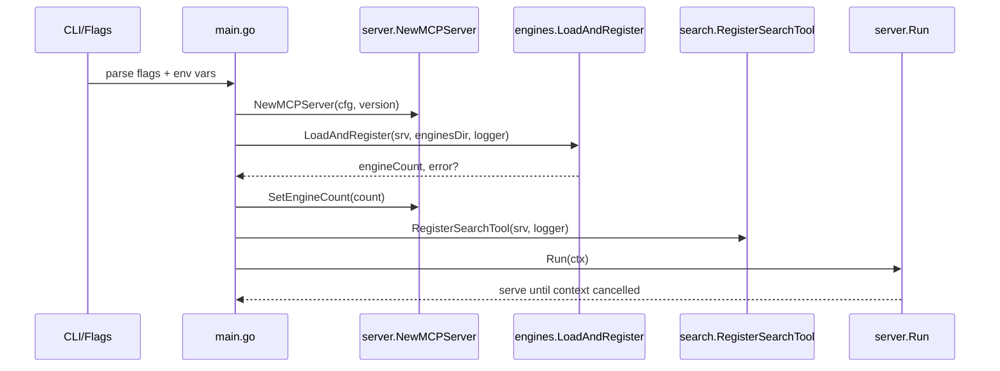
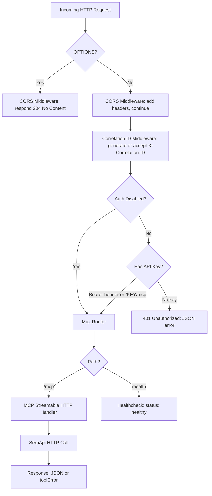

# Architecture

SerpApi MCP Server is a Go-based Model Context Protocol (MCP) server that exposes SerpApi search capabilities through a single, authenticated HTTP endpoint. This document covers the package layout, request flows, subsystem designs, test structure, and CI/CD pipeline.

- **Module:** `github.com/agenthands/serpapi-mcp`
- **Go version:** 1.25
- **Sole external dependency:** `github.com/modelcontextprotocol/go-sdk v1.5.0`

## Package Layout

### `cmd/serpapi-mcp` — Entry Point

CLI entry point: flag parsing, env var resolution, and server initialization orchestration.

No exported types (main package).

Key functions:

- `run(ctx context.Context, args []string, stdout io.Writer, stderr io.Writer) error` — all startup logic, extracted from `main()` for testability
- `envOr(key, fallback string) string` — env var with string fallback
- `envIntOr(key string, fallback int) int` — env var with int fallback
- `envBoolOr(key string, fallback bool) bool` — env var with bool fallback (1/true/yes)

Build-time variables: `version`, `commit`, `date` — injected via goreleaser ldflags.

Dependencies: `internal/server`, `internal/engines`, `internal/search`

### `internal/server` — MCP Server, Auth & CORS

HTTP server lifecycle, MCP protocol routing, authentication, and CORS handling.

Key types:

- `Config` — server configuration (Host, Port, CorsOrigins, AuthDisabled)
- `MCPServer` — wraps `mcp.Server` with HTTP handler, healthcheck, graceful shutdown
- `CORSConfig` — allowed origins list

Key functions:

- `NewMCPServer(cfg Config, version string) *MCPServer` — creates MCP server with streamable HTTP transport
- `buildHandler() http.Handler` — constructs chain: CORS → correlation → auth → mux
- `Run(ctx context.Context) error` — starts serving with graceful shutdown (10s timeout)
- `APIKeyFromContext(ctx context.Context) string` — extracts API key from request context
- `ContextWithAPIKey(ctx context.Context, key string) context.Context` — stores API key in context
- `NewCORSConfig(origins string) *CORSConfig` — parses comma-separated origins string
- `authOrPassthrough(disabled bool, next http.Handler) http.Handler` — auth or passthrough based on config
- `authMiddleware(next http.Handler) http.Handler` — Bearer header (priority) → path /{KEY}/mcp → 401

Dependencies: `internal/middleware`, `github.com/modelcontextprotocol/go-sdk/mcp`

### `internal/engines` — Engine Schema Loading & Discovery

Load, validate, and serve SerpApi engine JSON schemas as MCP resources.

Key types:

- `engineSchema` (unexported) — holds engine name + raw JSON

Key functions:

- `LoadAndRegister(srv *mcp.Server, enginesDir string, logger *slog.Logger) (int, error)` — loads all `.json` files, validates, registers MCP resources
- `EngineNames() []string` — returns sorted list of loaded engine names
- `RequiredParams(engineName string) []string` — extracts params with `required:true` from schema

Validation: filename must match `[a-z0-9_]+.json`, engine field must match filename stem. Fail-fast: returns error on first invalid/mismatched file.

Dependencies: `github.com/modelcontextprotocol/go-sdk/mcp`

### `internal/search` — Search Tool & Validation

MCP search tool implementation with input validation and SerpApi HTTP calls.

Key functions:

- `RegisterSearchTool(srv *mcp.Server, logger *slog.Logger)` — registers "search" tool on MCP server
- `callSearchTool(ctx context.Context, req *mcp.CallToolRequest) (*mcp.CallToolResult, error)` — core handler: unmarshal → validate → HTTP call → response
- `ValidateEngine(engine string) error` — binary search against loaded engine list
- `ValidateMode(mode string) error` — "complete" or "compact"
- `ValidateRequiredParams(engine string, params map[string]any) error` — checks `required:true` params present
- `toolError(code, message string) *mcp.CallToolResult` — flat JSON `{"error": code, "message": msg}` with `IsError=true`

Compact mode removes: `search_metadata`, `search_parameters`, `search_information`, `pagination`, `serpapi_pagination`. Default engine: `google_light`. Default mode: `complete`. 30-second per-request timeout via context.

Dependencies: `internal/engines`, `internal/middleware`, `internal/server`

### `internal/middleware` — HTTP Middleware

Cross-cutting HTTP middleware for request correlation.

Key functions:

- `CorrelationIDMiddleware(next http.Handler) http.Handler` — injects 32-char hex correlation ID
- `CorrelationIDFromContext(ctx context.Context) string` — extracts correlation ID
- `generateCorrelationID() string` — crypto/rand → 16 bytes → 32-char hex

Constants:

- `CorrelationIDHeader = "X-Correlation-ID"` — header name for client-provided or generated ID

Dependencies: none (only stdlib)

### Wiring at Startup

The `cmd/serpapi-mcp/main.go` `run()` function wires all packages together:

```go
mcpServer := server.NewMCPServer(cfg, version)
engineCount, err := engines.LoadAndRegister(mcpServer.MCPServer, *enginesDirFlag, slog.Default())
mcpServer.SetEngineCount(engineCount)
search.RegisterSearchTool(mcpServer.MCPServer, slog.Default())
return mcpServer.Run(ctx)
```

Flag/env parsing produces a `server.Config`, which creates the MCP server. Engine schemas are loaded and registered as MCP resources, then the search tool is registered. Finally, `Run()` starts the HTTP listener and blocks until the context is cancelled (SIGINT/SIGTERM).

## Startup Sequence



```
┌─────────────┐
│  CLI/Flags  │  Parse --host, --port, --cors-origins,
│  + env vars │  --auth-disabled, --engines-dir
└──────┬──────┘
       │
       ▼
┌──────────────────────┐
│  server.NewMCPServer │  Create MCP server with streamable HTTP
│  (cfg, version)      │  transport, build handler chain
└──────┬───────────────┘
       │
       ▼
┌────────────────────────────┐
│  engines.LoadAndRegister   │  Read engines/*.json, validate
│  (srv, enginesDir, logger)│  filenames, check engine field,
└──────┬─────────────────────┘  register MCP resources
       │ engineCount  ◄── fail-fast: returns error on
       ▼                  first invalid schema
┌──────────────────────┐
│  server.SetEngineCount│  Store count for startup logging
└──────┬───────────────┘
       │
       ▼
┌────────────────────────────┐
│  search.RegisterSearchTool │  Register "search" tool on
│  (srv, logger)             │  MCP server
└──────┬─────────────────────┘
       │
       ▼
┌──────────────────────┐
│  server.Run(ctx)     │  Start HTTP listener, block
│                      │  until SIGINT/SIGTERM via ctx
└──────────────────────┘
```

ASCII diagram (works in terminals and editors):

Flag/env parsing happens first (host, port, cors-origins, auth-disabled, engines-dir). Server creation initializes the MCP server and builds the handler chain. Engine loading is fail-fast — if any schema is invalid, the process exits with error. After search tool registration, the HTTP listener starts and blocks until SIGINT/SIGTERM via the signal context.

## HTTP Request Flow



```
Incoming HTTP Request
         │
         ▼
   ┌─────────────┐    OPTIONS?
   │  CORS        │──────────►  204 No Content (preflight)
   │  Middleware   │
   └──────┬──────-┘
          │  Add CORS headers, continue
          ▼
   ┌────────────────┐
   │  Correlation ID │  Client X-Correlation-ID or
   │  Middleware      │  generate 32-char hex from crypto/rand
   └──────┬─────────┘
          │
          ▼
   ┌─────────────┐    Auth disabled (--auth-disabled)?
   │  Auth        │──────────►  Skip to mux
   │  Middleware   │
   └──────┬──────-┘
          │  Check API key
          ├─── Bearer header (priority)
          ├─── /{KEY}/mcp path (fallback)
          │
          ▼
   ┌──────────┐     No key? ──►  401 {"error": "Missing API key..."}
   │  Mux      │
   │  Router    │
   └──────┬───-┘
          │
          ├──/health──►  {"status":"healthy","service":"SerpApi MCP Server"}
          │
          └──/mcp─────►  MCP Streamable HTTP Handler
                              │
                              ▼
                        SerpApi HTTP Call (30s timeout)
                              │
                              ▼
                        Response: JSON or toolError
```

ASCII diagram (works in terminals and editors):

Handler chain ordering: CORS first (so OPTIONS preflight gets CORS headers without hitting auth), then correlation ID, then auth, then mux router. Auth priority: Bearer header first, then path-based `/{KEY}/mcp`. The `/health` endpoint is exempt from authentication. Auth-disabled mode (`--auth-disabled` flag or `MCP_AUTH_DISABLED` env var) skips auth middleware entirely via `authOrPassthrough`.